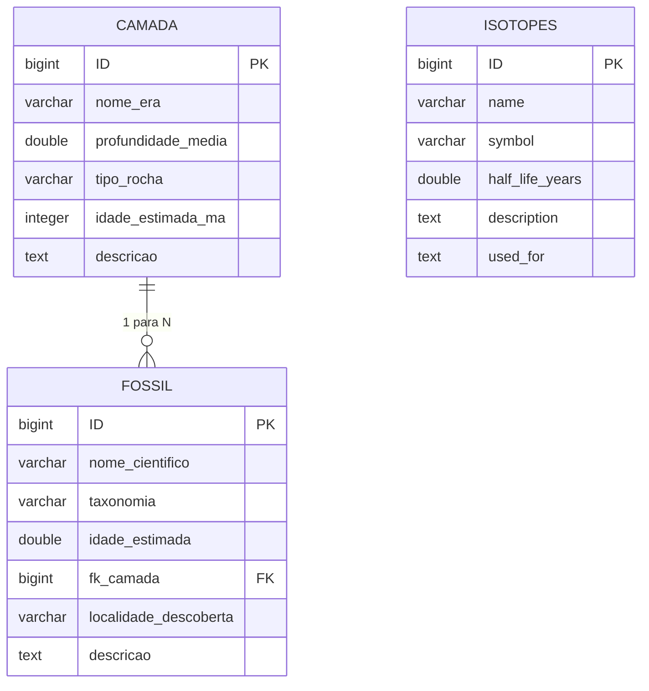

# Diagrama Entidade-Relacionamento (DER)

## Modelo conceitual



## Modelo físico (tabelas)

```
        ┌──────────────────────────┐
        │          CAMADA          │
        ├──────────────────────────┤
        │ ID               PK      │
        │ nome_era                │
        │ profundidade_media      │
        │ tipo_rocha              │
        │ idade_estimada_ma       │
        │ descricao               │
        └───────────▲────────────┘
                    │ 1
                    │
              N     │
        ┌───────────┴────────────┐
        │          FOSSIL        │
        ├────────────────────────┤
        │ ID               PK    │
        │ nome_cientifico        │
        │ taxonomia              │
        │ idle_estimada         │
        │ fk_camada        FK    │ ──── CAMADA(ID)
        │ localidade_descoberta  │
        │ descricao              │
        └────────────────────────┘


        ┌──────────────────────────┐
        │        ISOTOPES          │
        ├──────────────────────────┤
        │ ID               PK      │
        │ name                     │
        │ symbol                   │
        │ half_life_years          │
        │ description              │
        │ used_for                 │
        └──────────────────────────┘
```

## Regras de negócio (cardinalidade)

| Relação            | Cardinalidade | Explicação                                                          |
|--------------------|---------------|---------------------------------------------------------------------|
| CAMADA → FOSSIL    | 1 : N         | Uma camada pode conter **vários** fósseis, mas cada fóssil pertence a **uma única** camada (a FK `fk_camada` é obrigatória — todo fóssil foi encontrado em algum estrato). Apagar uma camada exige apagar/reatribuir seus fósseis (integridade referencial). |

## Mapeamento para o backend (Spring Boot / JPA)

| Tabela SQL   | Entidade JPA                          | Coluna SQL             | Atributo Java      |
|--------------|---------------------------------------|------------------------|--------------------|
| `camada`     | `com.kriptobioze.model.Camada`        | `nome_era`             | `nomeEra`          |
| `camada`     |                                       | `profundidade_media`   | `profundidadeMedia`|
| `camada`     |                                       | `tipo_rocha`           | `tipoRocha`        |
| `camada`     |                                       | `idade_estimada_ma`    | `idadeEstimadaMa`  |
| `fossil`     | `com.kriptobioze.model.Fossil`        | `nome_cientifico`      | `nomeCientifico`   |
| `fossil`     |                                       | `taxonomia`            | `taxonomia`        |
| `fossil`     |                                       | `idade_estimada`       | `idadeEstimada`    |
| `fossil`     |                                       | `fk_camada`            | `camada` (`@ManyToOne`) |
| `isotopes`   | `com.kriptobioze.model.Isotope`       | `name`                 | `name`                  |
| `isotopes`   |                                       | `symbol`               | `symbol`                |
| `isotopes`   |                                       | `half_life_years`      | `halfLifeYears`         |
| `isotopes`   |                                       | `description`          | `description`           |
| `isotopes`   |                                       | `used_for`             | `usedFor`               |